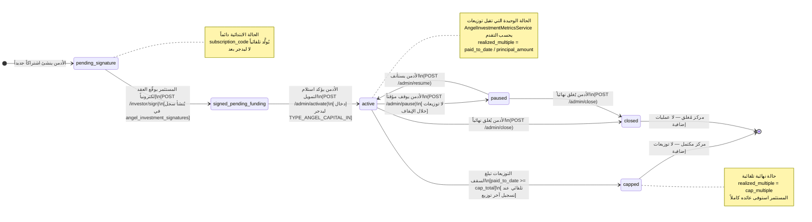
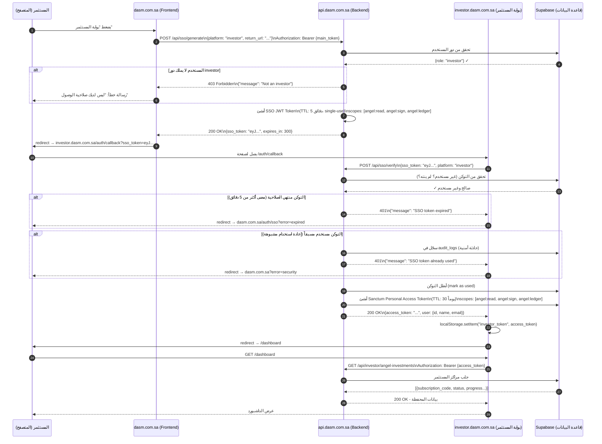
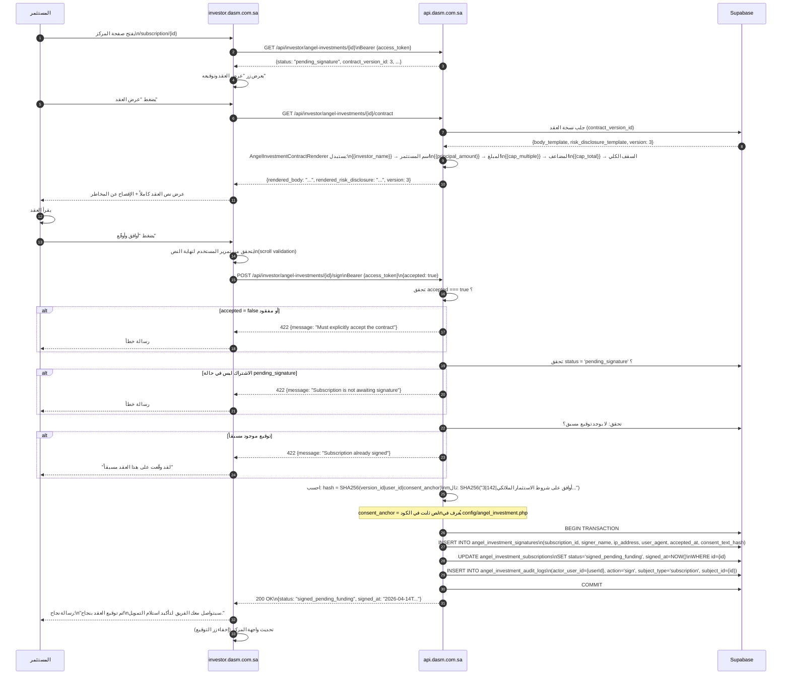
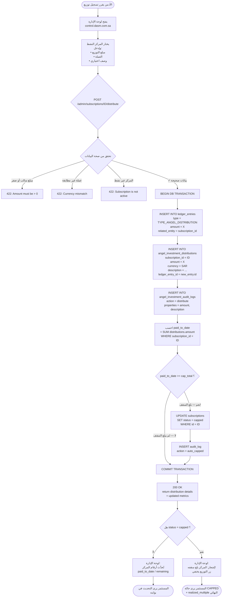

# مخططات التدفق
## نظام الاستثمار الملائكي — منصة DASM

> **الإصدار:** 1.0.0
> **التاريخ:** 2026-04-14
> **ملاحظة:** جميع المخططات بصيغة Mermaid — قابلة للعرض مباشرة في GitHub

---

## المخطط 1: دورة حياة الاشتراك الكاملة



---

## المخطط 2: تدفق SSO الكامل



---

## المخطط 3: تدفق التوقيع الإلكتروني



---

## المخطط 4: تدفق التوزيع وحساب السقف



---

## المخطط 5: نموذج البيانات (ER Diagram)

```mermaid
erDiagram
    users {
        bigint id PK
        string name
        string email
        string password_hash
        string type
    }

    angel_investment_contracts {
        bigint id PK
        string contract_number UK
        string title
        string status
        decimal default_cap_multiple
        string currency
        timestamp created_at
        timestamp updated_at
    }

    angel_investment_contract_versions {
        bigint id PK
        bigint contract_id FK
        int version
        text body_template
        text risk_disclosure_template
        timestamp published_at
        timestamp created_at
    }

    angel_investment_subscriptions {
        bigint id PK
        string subscription_code UK
        bigint user_id FK
        bigint contract_id FK
        bigint contract_version_id FK
        decimal principal_amount
        decimal cap_multiple
        string status
        timestamp signed_at
        timestamp activated_at
        timestamp created_at
        timestamp updated_at
    }

    angel_investment_signatures {
        bigint id PK
        bigint subscription_id FK_UK
        string signer_name
        string ip_address
        text user_agent
        timestamp accepted_at
        string consent_text_hash
        timestamp created_at
    }

    angel_investment_distributions {
        bigint id PK
        bigint subscription_id FK
        decimal amount
        string currency
        text description
        bigint ledger_entry_id FK_UK
        timestamp created_at
    }

    angel_investment_audit_logs {
        bigint id PK
        bigint actor_user_id FK
        string action
        string subject_type
        bigint subject_id
        jsonb properties
        timestamp created_at
    }

    ledger_entries {
        bigint id PK
        string type
        decimal amount
        string related_entity_type
        bigint related_entity_id
        timestamp created_at
    }

    users ||--o{ angel_investment_subscriptions : "يملك"
    users ||--o{ angel_investment_audit_logs : "ينفّذ"
    angel_investment_contracts ||--o{ angel_investment_contract_versions : "له نسخ"
    angel_investment_contracts ||--o{ angel_investment_subscriptions : "له اشتراكات"
    angel_investment_contract_versions ||--o{ angel_investment_subscriptions : "يُستخدم في"
    angel_investment_subscriptions ||--|| angel_investment_signatures : "له توقيع"
    angel_investment_subscriptions ||--o{ angel_investment_distributions : "له توزيعات"
    angel_investment_distributions ||--|| ledger_entries : "مرتبط بـ"
```

---

## المخطط 6: تدفق حساب المقاييس

```mermaid
flowchart LR
    A[(angel_investment_subscriptions\nprincipal_amount = 500,000\ncap_multiple = 2.0)] --> B

    B[(angel_investment_distributions\nWHERE subscription_id = X\nSUM amounts)]

    B --> C[paid_to_date\n= 150,000 ريال]
    A --> D[cap_total\n= 500,000 × 2.0\n= 1,000,000 ريال]

    C --> E[remaining_to_cap\n= cap_total - paid_to_date\n= 1,000,000 - 150,000\n= 850,000 ريال]

    C --> F[realized_multiple\n= paid_to_date / principal_amount\n= 150,000 / 500,000\n= 0.30×]

    D --> E
    C --> G[progress_percent\n= paid_to_date / cap_total × 100\n= 150,000 / 1,000,000 × 100\n= 15%]
    D --> G

    E --> H[(AngelInvestmentMetricsService\nيجمع الأرقام النهائية)]
    F --> H
    G --> H
    A --> H

    H --> I[استجابة API\n{\n  principal: 500000\n  cap_total: 1000000\n  paid_to_date: 150000\n  remaining_to_cap: 850000\n  realized_multiple: 0.30\n  progress_percent: 15\n  status: active\n}]

    I --> J[الداشبورد يعرض:\nشريط تقدم 15%\n850,000 ريال متبقي\nX0.30 عائد محقق]
```

---

## المخطط 7: تدفق العقد الكامل من الأدمن

```mermaid
flowchart TD
    A([الأدمن يريد إنشاء برنامج استثمار جديد]) --> B

    B[إنشاء عقد\nPOST /admin/contracts\n{\n  contract_number: ANGEL-2026-001\n  title: برنامج المستثمرين الملائكيين\n  default_cap_multiple: 2.0\n  currency: SAR\n}]

    B --> C{تحقق من contract_number}
    C -- "مكرر" --> D[422: Contract number exists]
    C -- "✓ فريد" --> E[(INSERT INTO contracts\nstatus = draft)]

    E --> F[نشر النسخة الأولى\nPOST /admin/contracts/ID/versions\n{\n  version: 1\n  body_template: نص العقد الكامل...\n  risk_disclosure_template: الإفصاح...\n}]

    F --> G{تحقق من الـ version رقم}
    G -- "مكرر لهذا العقد" --> H[422: Version exists]
    G -- "✓ جديد" --> I[(INSERT INTO contract_versions\npublished_at = NOW())]

    I --> J[العقد جاهز للاشتراكات]

    J --> K[إنشاء اشتراك للمستثمر\nPOST /admin/subscriptions\n{\n  user_id: 142\n  contract_id: 5\n  principal_amount: 500000\n  cap_multiple: 2.0\n}]

    K --> L{تحقق من المستثمر}
    L -- "لا يملك دور investor" --> M[422: User is not an investor]
    L -- "✓ مستثمر مؤهل" --> N[(INSERT INTO subscriptions\nstatus = pending_signature\nsubscription_code = ANGEL-X4K2-2026)]

    N --> O[إشعار للمستثمر:\nلديك عقد جديد بانتظار توقيعك]

    O --> P{هل المستثمر وقّع؟}
    P -- "لم يوقّع بعد" --> Q[الحالة: pending_signature\nالأدمن ينتظر]
    P -- "وقّع" --> R[الحالة: signed_pending_funding\nالأدمن يُؤكد استلام التمويل]

    Q --> P

    R --> S[تفعيل الاشتراك\nPOST /admin/subscriptions/ID/activate]

    S --> T[(BEGIN TRANSACTION\nUPDATE subscriptions\nSET status = active\nactivated_at = NOW()\n\nINSERT INTO ledger_entries\ntype = TYPE_ANGEL_CAPITAL_IN\namount = 500000\n\nINSERT INTO audit_logs\naction = activate\nCOMMIT)]

    T --> U([المركز نشط\nجاهز لاستقبال التوزيعات])
```
