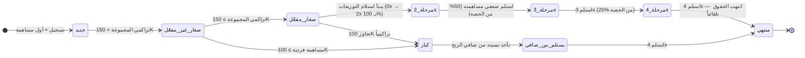
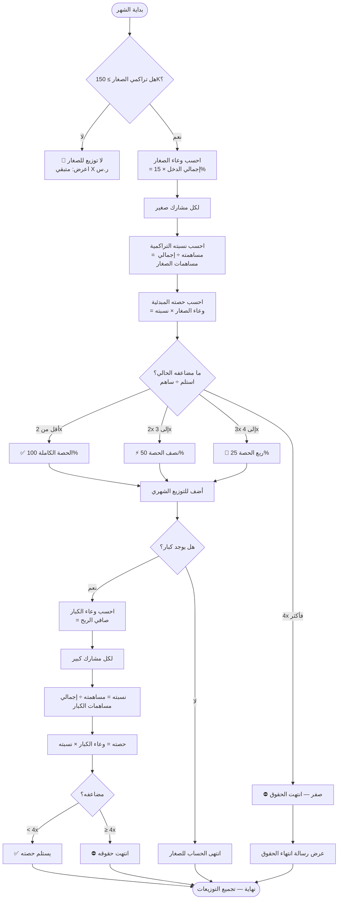
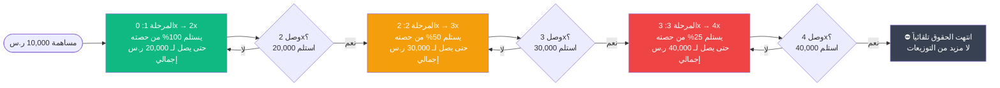
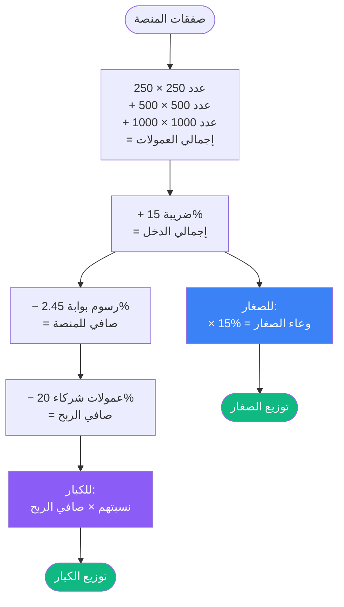
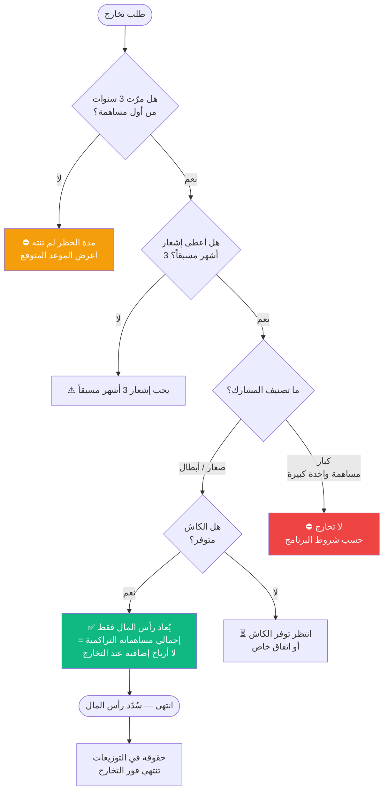
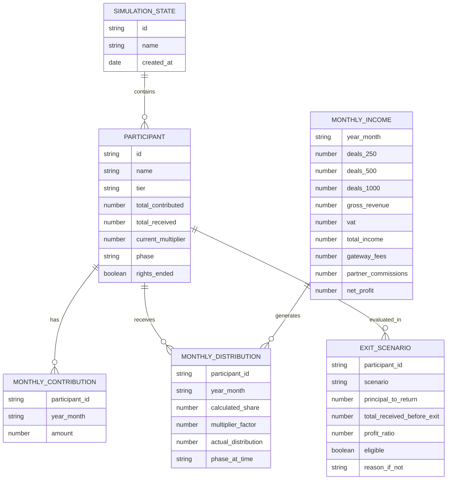
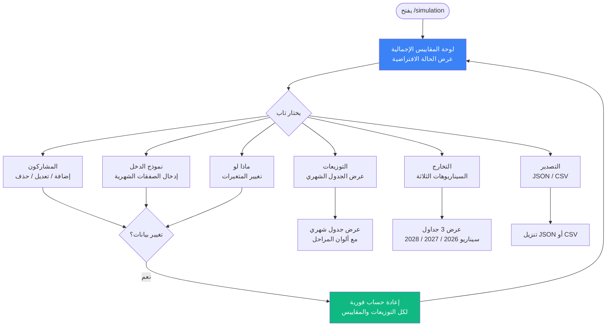
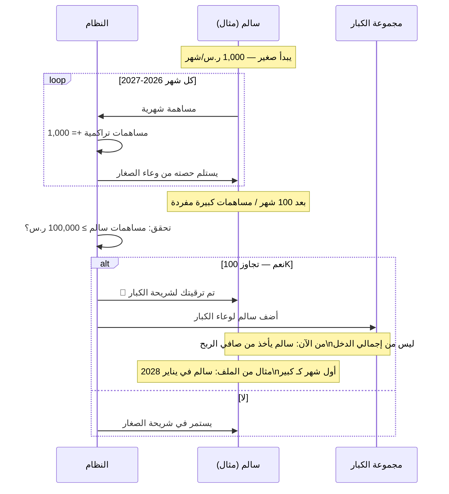

# FLOWCHARTS — برنامج أصدقاء الدعم المبكر

---

## مخطط 1: دورة حياة المشارك الكاملة

---

## مخطط 2: خوارزمية حساب التوزيع الشهري

---

## مخطط 3: آلية المضاعف المتناقص

---

## مخطط 4: نموذج الدخل والخصومات

---

## مخطط 5: قرار التخارج

---

## مخطط 6: نموذج البيانات (سيميوليشن)

---

## مخطط 7: تدفق واجهة المستخدم (UX Flow)

---

## مخطط 8: ترقي الشريحة (صغار → كبار)

